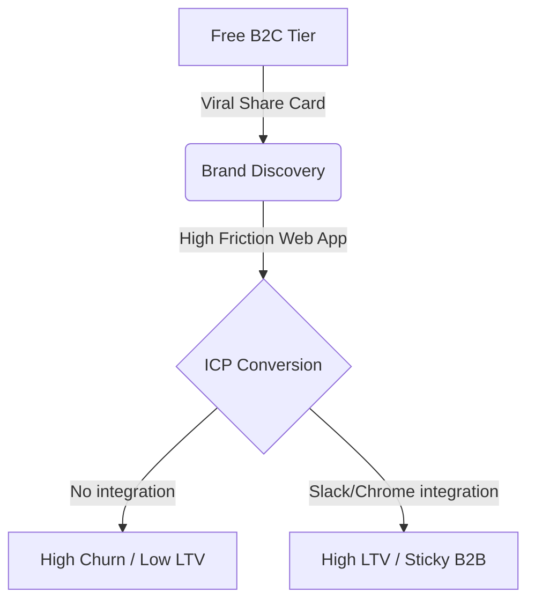
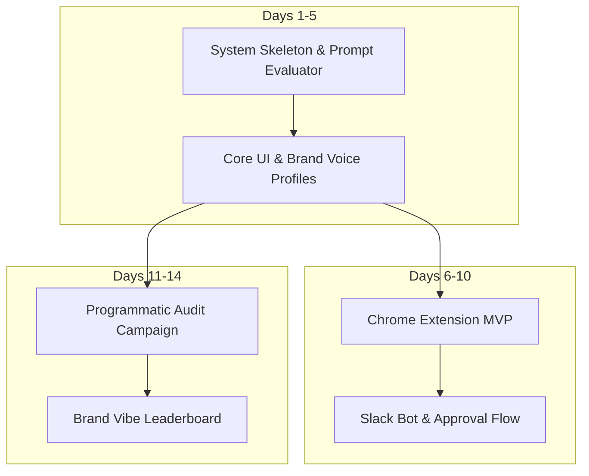

# Vibe Check: Master Unified Specification Document

> [!IMPORTANT]
> This document is the single source of truth for the entire Vibe Check project, combining the PRD, Marketing Strategy, Design Tokens, v1.1 Features, 360 Analysis, Growth Strategy, and the Introvert Validation Playbook. Work on this file directly for development reference.


# 1. Product Requirements Document (PRD v1.0)

Source file: `/Users/bharath/Desktop/on-going-projects/vibe_check_marketing/vibecheck-prd.md`

---

  
**AI VIBE CHECK**

Product Requirements Document

| *Does your brand content pass the Gen Z test?* AI-powered content analysis and rewriting for brands marketing to 18–26 year olds |
| :---: |

| Version | 1.0 — Initial Release |
| :---- | :---- |
| **Author** | Bharath |
| **Date** | May 2026 |
| **Status** | Approved for development |
| **Target launch** | 14 days from project start |

# **1\. Product overview**

## **1.1 Problem statement**

Indian brands targeting Gen Z (18–26 year olds) consistently publish content that misses the mark — corporate language, hard-sell tactics, and tonal mismatches that cause younger audiences to scroll past instantly. Content teams have no fast, reliable way to gut-check their copy before publishing.

| The core pain *A content manager at an Indian D2C brand spends 30 minutes writing a tweet. It goes live. It gets 3 likes. They have no idea why it failed, and no time to find out. This happens 5–10 times per week across every brand marketing to young consumers.* |
| :---- |

## **1.2 Solution**

AI Vibe Check is a web-based tool that analyzes any piece of brand content (tweet, TikTok script, LinkedIn post, ad copy, product description) and returns:

* A 0–100 Gen Z approval score with a plain-English verdict

* 3–5 specific issues calling out exact phrases and why they fail

* A rewritten version in authentic Gen Z voice

* A shareable result card for social distribution

## **1.3 Strategic positioning**

Framing: A fast, honest second opinion from an AI that grew up on the internet — not a scientific measurement tool. This framing is accurate, defensible, and sets correct expectations.

Primary market: Indian B2B brand and marketing teams ($19–39/mo).

Secondary market: Individual creators and students (free tier, viral acquisition engine).

Competitive gap: No direct competitor owns this positioning, especially in the Indian market.

## **1.4 Key scores at a glance**

| Dimension | Score | Rationale |
| :---- | :---: | :---- |
| **Build ease** | **9/10** | *Claude API \+ Next.js \+ Cloudflare. No new tools. Pure text I/O. \~5 day MVP.* |
| **Monetise ease** | **8/10** | *B2B subscription at $19/mo. 50 customers \= \~₹9.6L ARR. Reachable solo.* |
| **Viral potential** | **7/10** | *Shareable result cards drive organic acquisition. B2C free tier is the loop.* |
| **Genuine value** | **8/10** | *Removes obvious cringe and rewrites in useful register. 70–75% accuracy for stated purpose.* |
| **Gen Z fit** | **7/10** | *Product is for brands targeting Gen Z, not Gen Z directly. ICP clarity needed.* |

# **2\. Target audience**

## **2.1 Primary ICP — Brand and marketing teams (pays)**

| Ideal customer profile Role: Content manager, social media executive, or founder at a brand Company: Indian D2C, EdTech, fintech, or FMCG brand actively targeting 18–26 year olds Size: 5–200 person team. Has a dedicated content person but no Gen Z research budget. Volume: Publishes 20–50 pieces of content per week across platforms Pain: No fast way to check if copy lands with younger audience before publishing |
| :---- |

Example companies (reachable via LinkedIn outreach):

* Mamaearth, mCaffeine, Minimalist — D2C beauty brands targeting Gen Z women

* upGrad, Physics Wallah, Unacademy — EdTech brands marketing to college-age students

* CoinSwitch, Groww, Fi Money — fintech apps with young-first positioning

* Zepto, Blinkit, Swiggy Instamart — quick commerce with high Gen Z usage

* Boat, Noise, Fire-Boltt — consumer electronics brands with Gen Z as primary buyer

## **2.2 Secondary audience — Individual creators (acquires, doesn’t pay initially)**

18–26 year old content creators, students, and indie professionals who want to know if their personal content (LinkedIn posts, Twitter threads, college presentations) sounds authentic. They use the free tier, share results virally, and occasionally convert to paid when they monetise their own audience.

Acquisition value: Each shared result card is a free ad. This audience is the growth engine, not the revenue engine.

# **3\. User stories**

## **3.1 Primary user stories**

| As a... | I want to... | So that... |
| :---- | :---- | :---- |
| Content manager at a D2C brand | paste a tweet draft and get instant feedback on whether it sounds Gen Z-native | I can fix cringe copy before it goes live and embarrasses the brand |
| Social media executive | get a Gen Z-native rewrite of our ad copy | I can present a better version to my team without doing it manually |
| Startup founder | check if our product page copy lands with younger users | we’re launching to a Gen Z audience and I can’t afford to miss the tone |
| Student content creator | see if my LinkedIn post sounds cringe before I post it | I’m building my personal brand and don’t want to sound like a boomer |
| Marketing agency | run client content through a vibe check before delivering | it adds a quality signal to our deliverables without extra research cost |

# **4\. Features and requirements**

## **4.1 Feature prioritisation**

P0 \= must have for launch. P1 \= must have within 2 weeks of launch. P2 \= nice to have in month 2\.

| Feature | Priority | Phase | Notes |
| :---- | ----- | ----- | :---- |
| **Text input with content type selector** | **P0** | Day 2 | *Tweet / LinkedIn / TikTok script / ad copy / custom* |
| **Gen Z score (0–100) with verdict label** | **P0** | Day 2 | *Plain-English verdict, not just a number. e.g. 'Hard cringe'* |
| **Specific issues list (3–5 bullets)** | **P0** | Day 2 | *Must quote exact words from the original, not generic advice* |
| **Gen Z rewrite** | **P0** | Day 2 | *One-click copy button. This is the highest-value output.* |
| **Shareable result card** | **P0** | Day 3 | *OG image generated for social sharing. Score \+ verdict visible.* |
| **IP-based rate limiting (3 free/day)** | **P0** | Day 4 | *Upstash Redis. Soft limit with email capture, not hard block.* |
| **Email capture before paywall** | **P0** | Day 4 | *Collect email before showing upgrade prompt. Feeds list.* |
| **Landing page with live demo embed** | **P0** | Day 5 | *3 before/after examples from real Indian brand tweets.* |
| **Stripe subscription ($19/mo)** | **P1** | Day 11 | *One plan only at launch. Unlimited checks \+ team sharing.* |
| **User dashboard (check history)** | **P1** | Day 12 | *Brand teams need to review and share past checks.* |
| **Team workspace (share checks)** | **P1** | Day 13 | *Invite team members. Required for $39/mo team plan.* |
| **Content type analytics** | **P2** | Month 2 | *Which content types score worst. Useful for brand reports.* |
| **Bulk CSV input** | **P2** | Month 2 | *Upload 50 pieces of content, get all scored at once.* |
| **Slack / Notion integration** | **P2** | Month 3 | *For teams already living in these tools.* |

## **4.2 Core user flow**

The complete flow a brand user experiences, from landing to sharing:

| User lands on vibecheck.in and sees 3 before/after examples immediately (no login wall) Pastes their own content into the input box, selects content type, clicks Run vibe check Result appears: score circle, verdict, issues list, rewrite. All visible without scrolling on desktop. User copies the rewrite or shares the result card. Sharing generates a unique URL. After 3 checks in a day, email capture prompt appears: Enter your email for 2 bonus checks today After email capture, upgrade prompt: Unlimited checks for your team at $19/mo |

# **5\. Technical architecture**

## **5.1 Tech stack**

| Layer | Technology | Rationale |
| :---- | :---- | :---- |
| Framework | Next.js 14 (App Router) + **Vercel AI SDK** | Bharath already uses it. Vercel AI SDK provides provider-agnostic model routing and native structured JSON schema validation. |
| Runtime | Bun | Faster installs and dev server. Compatible with Next.js. |
| Hosting | Cloudflare Pages | Free tier, global CDN, edge functions for rate limiting. |
| AI Model | **DeepSeek-V3 (`deepseek-chat`)** | Default model. Matches GPT-4o / Claude 3.5 Sonnet text quality at 21x-53x lower cost. |
| Fallback Model | **Llama 3.3 70B via Groq** | Secondary model for sub-300ms latency and high-speed execution pings. |
| Rate limiting | Upstash Redis | Serverless, no infra, pay-per-request. IP-based daily limits. |
| Payments | Stripe Checkout | Self-serve billing. Works in India for USD subscriptions. |
| Email | Resend | Simple API. Free tier for first 3,000 emails/mo. |
| Auth (P1) | Clerk or NextAuth | Only needed when team dashboard ships. Skip for MVP. |
| Storage (P1) | Convex or Cloudflare KV | Check history for team plans. Not needed on day 1\. |

## **5.2 Prompt architecture**

The prompt is the core IP of the product. It must be engineered carefully and iterated on before UI work begins.

| System prompt (send once per session) *You are a 22-year-old Gen Z content strategist who grew up on TikTok, Twitter, and Instagram. You review brand content and give brutally honest, specific feedback. You hate corporate speak, hard sells, and anything that sounds like it was written by someone who learned about Gen Z from a marketing report. You care about authenticity, wit, and voice. You always quote specific phrases from the original when explaining problems.* User message template *Review this \[CONTENT\_TYPE\]: \[USER\_TEXT\]. Return a JSON object with: score (0-100 integer), verdict (max 8 words, no punctuation), issues (array of 3-5 strings each quoting a specific phrase and explaining why it fails), rewrite (rewritten version in authentic Gen Z voice, same length as original). Return JSON only, no preamble.* Critical constraints • Temperature: 0.7 — enough variation for personality, not enough for hallucination • Max tokens: 800 — keeps response fast and cost low • Parse JSON strictly — wrap in try/catch, strip markdown fences if present • Do not show a raw score as scientific truth in UI — always pair with the plain-English verdict |
| :---- |

## **5.3 Cost model**

At DeepSeek-V3 pricing (~$0.14/M input tokens, ~$0.28/M output tokens), a typical check costs approximately $0.0001–0.0002 per request. This means:

* 1,000 free checks per day costs ~$0.10–0.15 in API fees

* A $19/mo subscriber doing 20 checks/day costs ~$0.06–0.09/mo in API fees

* Gross margin on paid subscribers is approximately 99.5%

* Note: Avoid reasoning models like DeepSeek-R1 for this task, as the generation of thinking tokens significantly increases latency (10s+) and billing overhead.

Cost is not a risk at current scale. Monitor monthly and set a $50 API spend alert.


# **6\. Revenue model**

## **6.1 Pricing tiers**

|  | Free | Pro — $19/mo |
| ----- | ----- | ----- |
| **Checks per day** | 3 | Unlimited |
| **Score \+ verdict** | Yes | Yes |
| **Issues list** | Yes | Yes |
| **Gen Z rewrite** | Yes | Yes |
| **Shareable card** | Yes | Yes |
| **Check history** | No | Last 30 days |
| **Team sharing** | No | Up to 5 seats |
| **Bulk CSV input** | No | Yes (month 2\) |
| **Priority support** | No | Yes |

Note: Team plan at $39/mo (up to 10 seats) to be introduced in month 2 once single-user demand is proven. Do not build it before then.

## **6.2 Revenue projections**

| Customers | Price/mo | MRR | ARR (USD) | ARR (INR) |
| :---: | :---: | :---: | :---: | :---: |
| 10 | $19 | $190 | $2,280 | \~₹1.9L |
| 25 | $19 | $475 | $5,700 | \~₹4.8L |
| **50 ← target** | **$19** | **$950** | **$11,400** | **\~₹9.6L** |
| 100 | $19 | $1,900 | $22,800 | \~₹19.2L |
| 50 | $39 | $1,950 | $23,400 | \~₹19.7L |

Target: 50 Pro subscribers within 90 days of launch. That is \~₹9.6L ARR — a meaningful first milestone for a solo product.

| $950 Target MRR (day 90\) | $11,400 Target ARR | ₹9.6L INR equivalent | 50 Customers needed |
| :---: | :---: | :---: | :---: |

# **7\. Go-to-market strategy**

## **7.1 Week 1 — build and soft launch**

* Ship working v1 (input → score → rewrite → share) in 5 days

* Share in 2–3 communities already joined: IndieHackers, relevant WhatsApp/Slack groups

* Post on Twitter/X with a real before/after example from an Indian brand tweet

* Goal: 50 signups, 10 people who use it without being asked

## **7.2 Week 2 — first 10 brand customers**

* Identify 10 content managers at target brands on LinkedIn

* Send 10 personalised DMs: one sentence problem, one link, one ask for feedback (not a sale)

* Offer first 10 paying customers 3 months at $9/mo — early adopter pricing

* Get on a 15-minute call or async Loom review with anyone who responds

* Goal: 3 paying customers by end of week 2

## **7.3 Month 1–3 — compound**

* Every new style drop (e.g. adding YouTube Shorts script as a content type) is a launch moment

* Write one case study per paying customer: what they pasted, what changed, what the brand did

* Post weekly on Twitter/X: one real brand before/after per week (with permission or anonymised)

* SEO target: ‘how to write for Gen Z’, ‘Gen Z marketing tips India’ — long-tail, low competition

* When 10 paying customers reached: introduce annual plan at 2 months free ($190/yr)

## **7.4 Distribution loop**

| The self-reinforcing acquisition loop 1\. Free user pastes content and gets a score 2\. They share the result card on Twitter/LinkedIn with 'my brand copy scored 18/100 lol' 3\. Followers click the shared link and try it on their own content 4\. Brand team member finds it useful, shares with their content manager 5\. Content manager converts to Pro — the result card generated the B2B lead |
| :---- |

# **8\. Success metrics**

## **8.1 Launch metrics (day 1–14)**

| 50+ Signups | 10+ Active checkers | 20+ Shares | 1+ Paying customers |
| :---: | :---: | :---: | :---: |

## **8.2 Month 1 metrics**

| $190+ MRR | 200+ Email list | 1,000+ Checks run | 30%+ Retention (D7) |
| :---: | :---: | :---: | :---: |

## **8.3 Month 3 target (the real milestone)**

| $950 MRR | 50 Paying brands | ₹9.6L ARR (INR) | \<5% Churn/mo |
| :---: | :---: | :---: | :---: |

## **8.4 North star metric**

| Number of brand teams running a check every week *This measures whether the tool has become a habit, not just a novelty. Weekly active brand teams is the leading indicator of low churn and high LTV.* |
| :---: |

# **9\. Risks and mitigations**

| Risk | Likelihood | Impact | Mitigation |
| :---- | ----- | ----- | :---- |
| **Accuracy is questioned by users** | **High** | **High** | *Reframe as perspective, not science. Lead with rewrite quality over score. Add 'How we score this' tooltip.* |
| **Low B2B conversion from free users** | **Med** | **High** | *Targeted LinkedIn outreach to 10 brands in week 2\. Don’t wait for inbound at launch.* |
| **High API cost from viral spike** | **Low** | **Med** | *Set $50/day spend cap on Anthropic API. Rate limit aggressively. Upgrade prompt on cap hit.* |
| **Competitor builds same thing fast** | **Med** | **Med** | *First-mover \+ Indian market focus \+ brand relationships are the moat. Speed to 50 customers matters more than features.* |
| **Prompt produces harmful rewrites** | **Low** | **High** | *Add content moderation layer. Explicitly instruct Claude to refuse to rewrite hate speech, political content, or personal attacks.* |
| **Context-switch to another product** | **High** | **High** | *Commit to this product for 90 days regardless of new ideas. Write this commitment down. Track it weekly.* |

# **10\. 14-day build plan**

## **Phase 1 — Build (days 1–5)**

| Day | Focus | Done when... |
| :---- | :---- | :---- |
| **Day 1** | Project setup \+ prompt | Claude prompt tested manually on 10 real brand tweets. Skeleton deployed to Cloudflare Pages. |
| **Day 2** | Core UI | Text in, result out. Score, issues, rewrite all rendering. API route live. No auth, no Stripe. |
| **Day 3** | Share card | Shareable URL with OG image. Shared link shows result. Try it yourself CTA present. |
| **Day 4** | Rate limit \+ email capture | 3 free checks/day working. Email collected before paywall. Emails going to Resend list. |
| **Day 5** | Landing page \+ deploy | Live on custom domain. 3 before/after examples using real Indian brand copy. Shared in 3 communities. |

## **Phase 2 — Validate (days 6–10)**

* Days 6–7: Find 10 brand content managers on LinkedIn. Send DMs. Observe real usage via Loom or call.

* Days 8–9: Fix the top 3 UI friction points. Improve prompt based on real input types observed.

* Day 10: Decision checkpoint. Green (continue) if 5+ real users, 2+ said they’d pay. Red (pivot) if nobody found the rewrite useful.

## **Phase 3 — Monetise (days 11–14)**

* Days 11–12: Add Stripe Checkout. One plan ($19/mo). Test full free → upgrade → cancel flow.

* Days 13–14: Email list with launch announcement. Offer first 10 subscribers 3 months at $9/mo. First paying customer \= milestone.

# **11\. Open questions**

These are unresolved decisions that should be answered by talking to users, not by building in advance:

* Should the score be shown as a number (18/100) or a category (Hard cringe / Needs work / Clean / Fire)? Test both in the first week.

* Do brand users want to save and compare checks over time from day 1, or is that a month-2 feature? Ask, don’t assume.

* Is $19/mo the right price, or should it be $29? Run a landing page A/B test in week 3\.

* Should the rewrite match the original length exactly, or is it acceptable to be longer/shorter? Prompt engineering question — test with real users.

* Is the Indian market big enough at $19/mo, or should we price in INR (₹1,499/mo) for easier conversion? Research in week 2 during brand outreach.

# **12\. Appendix**

## **A. Prompt test cases**

Run these 10 inputs against the prompt before shipping. All should produce specific, useful output:

* A Mamaearth Instagram caption about a new face wash (D2C beauty, hard sell)

* An upGrad LinkedIn post about a data science course (EdTech, corporate tone)

* A CoinSwitch tweet about market volatility (fintech, jargon-heavy)

* A Zepto app push notification about a sale (quick commerce, discount-first)

* A Boat headphones TikTok script (consumer electronics, feature list)

* A startup founder’s personal LinkedIn post about hustle culture (individual creator)

* An FMCG brand tweet using ‘slay’ and ‘no cap’ incorrectly (cringe Gen Z speak attempt)

* A genuinely good brand tweet (should score 70+ and produce minimal issues)

* A blank/empty input (should error gracefully, not crash)

* A tweet in Hinglish (Hindi \+ English) — should still produce useful feedback

## **B. Non-goals (explicitly out of scope for v1)**

* Video analysis — text only for v1

* Image or design feedback — text only for v1

* Multi-language support beyond Hinglish — English \+ Hinglish only

* Historical trend tracking — month 2

* API for third-party integrations — month 3

* Mobile app — responsive web only for v1

## **C. Definition of done**

| This PRD is complete when: ✅ 1 paying customer exists ✅ They renewed for a second month without being asked ✅ At least one user said the rewrite was better than what they wrote themselves ✅ MRR \> $0 before any new product ideas are explored |
| :---- |

## **D. Interconnected Project Documents (May 2026)**

Post-validation and strategic artifacts for construction, marketing, and validation:

| Document | Description / Purpose |
| :--- | :--- |
| [Product Marketing Context](file:///Users/bharath/Desktop/on-going-projects/vibe_check_marketing/.agents/product-marketing-context.md) | Positioning, ICP, personas, objections, brand voice guidelines. |
| [DESIGN.md](file:///Users/bharath/Desktop/on-going-projects/vibe_check_marketing/DESIGN.md) | Design tokens, visual guidelines, typography, components. |
| [v1.1-features.md](file:///Users/bharath/Desktop/on-going-projects/vibe_check_marketing/docs/v1.1-features.md) | Revised roadmap priorities, verdict bands, and flow modifications. |
| [project_analysis.md](file:///Users/bharath/.gemini/antigravity/brain/0c6be20d-840f-4b61-bcec-d70a300836f6/project_analysis.md) | 360-degree leadership (CEO, CFO, CTO, PM, VC) analysis. |
| [growth_strategy.md](file:///Users/bharath/.gemini/antigravity/brain/0c6be20d-840f-4b61-bcec-d70a300836f6/growth_strategy.md) | Moat engineering, GTM loops, and programmatic cold outreach audits. |
| [unified_mvp_spec.md](file:///Users/bharath/.gemini/antigravity/brain/0c6be20d-840f-4b61-bcec-d70a300836f6/unified_mvp_spec.md) | Unified build blueprint combining product, design, and introvert sales playbooks. |


# 2. Product Marketing & Positioning Context

Source file: `/Users/bharath/Desktop/on-going-projects/vibe_check_marketing/.agents/product-marketing-context.md`

---

# Product Marketing Context

*Last updated: May 23, 2026*

## Product Overview

**One-liner:** Pre-publish tone QA for Indian brands marketing to 18–26 year olds.

**What it does:** Vibe Check analyzes brand copy (social posts, ad copy, push notifications, scripts) and returns a plain-English verdict, specific issues with quoted phrases, and a usable rewrite—before content goes live. It is a fast second opinion, not a scientific Gen Z measurement tool.

**Product category:** AI copy QA / brand tone checker (pre-publish workflow tool).

**Product type:** B2B SaaS web app with a free B2C acquisition tier.

**Business model:**
- **Free:** 3 checks/day, full outputs, public share cards (creators)
- **Pro:** $19/mo USD (test ₹1,499/mo in India outreach)—unlimited checks*, history, private shares, brand profile
- **Team:** $39/mo (month 2+)—seats + shared workspace after single-seat demand is proven

*Fair use: ~500 checks/month in ToS; adjust if power users appear.

**Public names:**
- Consumer/creator: **Vibe Check**
- B2B: **Vibe Check for Teams** (invoices, LinkedIn, sales)
- Domain: **vibecheck.in**

**Tagline (primary):** Catch the cringe before it goes live.

**Tagline (B2B):** Pre-publish tone QA for brands talking to Gen Z in India.

---

## Target Audience

**Target companies:** Indian D2C, EdTech, fintech, quick commerce, and consumer electronics brands actively targeting 18–26 year olds. Team size 5–200; dedicated content/social role; no Gen Z research budget.

**Decision-makers:** Content manager, social media executive, marketing lead, founder (early-stage).

**Primary use case:** Gut-check and fix copy in the last mile before publishing to social, app, or ads.

**Jobs to be done:**
1. Avoid embarrassing tone misses before posts go live.
2. Get a better rewrite without spending 30+ minutes guessing.
3. Show the team/agency a quick quality signal on client copy.

**Use cases:**
- Tweet/IG caption before scheduling
- App push or in-app notification copy
- LinkedIn post aimed at college-age audience
- TikTok/Reels script read-through
- Agency QA on client deliverables (month 2+)

**Secondary audience (acquire, don’t optimize for revenue day 1):** 18–26 creators and students checking personal LinkedIn/Twitter copy; viral share loop.

---

## Personas

| Persona | Cares about | Challenge | Value we promise |
|---------|-------------|-----------|------------------|
| **User** (content manager) | Speed, not looking foolish, rewrite quality | No time to research Gen Z; posts flop with no clear why | Specific feedback + copy-paste fix in under 10 seconds |
| **Champion** (social lead) | Team consistency, throughput | Reviewing every post doesn’t scale | Same bar for every piece before publish |
| **Decision maker** (marketing head) | Brand risk, efficiency | Can’t hire a Gen Z consultant | Cheap always-on second opinion |
| **Financial buyer** (founder) | ROI, tool sprawl | Already paying for scheduling/analytics | One narrow job done well; cancel if no weekly use |
| **Technical influencer** (rare) | Security, API, data | Shadow IT AI usage | Controlled tool with moderation + no training on their data (state clearly) |

---

## Problems & Pain Points

**Core problem:** Brand copy sounds corporate, salesy, or fake-Gen-Z; young audiences scroll past; teams don’t know why until after publish.

**Why alternatives fall short:**
- **ChatGPT / custom GPT:** Generic; no India/Hinglish context; no workflow, history, or team share; inconsistent without evals.
- **Brand voice platforms (ToneGuide, Hypotenuse, Typetone):** Built for full brand guidelines and scale content ops—not a fast “will this flop with 22-year-olds?” check.
- **Compliance tools (GetGenAI):** Legal/regulatory focus, enterprise pricing—not tone for youth audiences.
- **Manual peer review:** Slow, subjective, not available at 11pm before a post goes out.

**What it costs them:**
- 30+ minutes per post × 20–50 posts/week
- Low engagement, brand cringe moments, wasted ad spend
- Career/social capital (“why did legal/marketing let this through?”)

**Emotional tension:** Fear of sounding like a boomer brand; pressure to “be relatable”; embarrassment when slang is wrong.

---

## Competitive Landscape

**Direct:** Generic “tone checker” AI apps and custom ChatGPT prompts—fall short on India-specific nuance, quoted issues, and pre-publish workflow.

**Secondary:** ToneGuide, Hypotenuse brand voice, Typetone—fall short for buyers who need a **fast, opinionated youth-audience check**, not full guideline ingestion and copilot suites.

**Indirect:** ChatGPT, Jasper, native platform AI—fall short on habit (“one paste before post”) and positioning unless we own the wedge + integrations.

---

## Differentiation

**Key differentiators:**
1. **India-first:** Hinglish, local brand context, examples from Indian D2C/EdTech/fintech.
2. **Quoted issues:** Calls out exact phrases, not generic “be more authentic” advice.
3. **Dual rewrite modes:** **Fix** (de-cringe, same intent) vs **Gen Z** (optional register shift).
4. **Honest framing:** Perspective, not science—verdict bands + rewrite over vanity score.
5. **Shareable proof:** Result cards for creators; **private/unlisted** links for brands.

**How we do it differently:** Narrow job (pre-publish youth-audience tone QA), engineered prompt + golden tests, not “all-in-one content AI.”

**Why that’s better:** Faster than research, cheaper than consultants, more specific than ChatGPT in one paste.

**Why customers choose us:** Saves embarrassment and time on the posts that matter most to young audiences.

---

## Objections

| Objection | Response |
|-----------|----------|
| “How do you know what Gen Z thinks?” | We don’t claim census data—we give a consistent, brutally specific editorial read. Judge us on whether the rewrite is better than yours. |
| “We can do this in ChatGPT.” | So can everyone—but not with India/Hinglish calibration, quoted issues, Fix vs Gen Z modes, history, or team share in one click. |
| “The score feels arbitrary.” | Use the verdict band and issues list; score is secondary. We’re optimizing for useful rewrites, not precision science. |
| “We don’t want slang-heavy copy.” | Default **Fix** mode removes cringe without forcing slang; Gen Z mode is optional. |
| “I can’t share a 18/100 score publicly.” | Pro uses **private/unlisted** result links; public cards are for creators/free tier. |

**Anti-persona:**
- Brands not targeting under-30 audiences
- Enterprises needing legal/compliance sign-off (use GetGenAI-class tools)
- Teams wanting full content generation suites
- Users who need video/image analysis (out of scope v1)

---

## Switching Dynamics

**Push:** Posts get 3 likes; “slay/no cap” tweets backfire; no time to test copy with real Gen Z.

**Pull:** Instant verdict + rewrite; feels like a sharp colleague; low price vs agency review.

**Habit:** Already posting via Buffer/Hootsuite + ChatGPT; need bookmarklet/Slack later to intercept.

**Anxiety:** AI will make us sound try-hard; data/privacy; boss sees a bad score.

**Mitigate anxiety:** Private shares, Fix-first rewrites, clear “how it works,” moderation on harmful content.

---

## Customer Language

**How they describe the problem:**
- “Our tweets sound so corporate.”
- “I don’t know if this will land with college kids.”
- “We tried Gen Z slang and it backfired.”
- “I spent 30 minutes on a post and it did nothing.”
- “I need a second pair of eyes before this goes live.”

**How they describe us (target):**
- “It caught the hard-sell line I missed.”
- “The rewrite was actually postable.”
- “Faster than bothering our intern.”

**Words to use:** Pre-publish, tone check, cringe, corporate speak, hard sell, rewrite, verdict, young audience, India, Hinglish, second opinion.

**Words to avoid:** Scientific, guaranteed, official Gen Z certification, slay/no cap (in product UI), “AI that grew up on the internet” (in B2B sales).

**Glossary:**

| Term | Meaning |
|------|---------|
| **Check** | One analysis run on pasted copy |
| **Verdict band** | Hard cringe / Needs work / Clean / Fire |
| **Fix rewrite** | Same intent, less cringe, brand-safe |
| **Gen Z rewrite** | More casual/youth register (optional) |
| **Result card** | Shareable summary (score, verdict, optional issues) |
| **Brand profile** | Saved tone examples + rules for repeat checks |

---

## Brand Voice

**Tone:** Direct, sharp, slightly witty—never try-hard teen.

**Style:** Short sentences; blunt verdicts; transparent about AI limits.

**Personality:** Honest friend, fast editor, anti-corporate, India-aware, not preachy.

---

## Proof Points

**Metrics (targets):** 50 Pro brands @ 90 days; weekly active brand teams as north star; D7 retention 30%+ on free.

**Customers (outreach list):** Mamaearth, mCaffeine, upGrad, PW, CoinSwitch, Groww, Zepto, Swiggy Instamart, Boat, Noise (permission or anonymized case studies).

**Testimonials:** Collect after manual onboarding: “The rewrite was better than what I wrote.”

**Value themes:**

| Theme | Proof |
|-------|-------|
| Speed | Result in &lt;10s |
| Specificity | Issues quote exact phrases |
| Safety | Fix mode + private share for B2B |
| India | Hinglish + local examples on landing page |

---

## Goals

**Business goal:** ₹9.6L ARR (~$11.4k) from 50 Pro subscribers within 90 days of launch.

**Conversion action:** Brand content manager runs 3+ checks in week 1 → email capture → Pro subscription.

**Current metrics:** Pre-launch; day-10 checkpoint = 5+ real users, 2+ would pay; definition of done = 1 renewing paid customer who values the rewrite.

---

## Related Project Documents

*   **PRD:** [vibecheck-prd.md](file:///Users/bharath/Desktop/on-going-projects/vibe_check_marketing/vibecheck-prd.md)
*   **Design Guide:** [DESIGN.md](file:///Users/bharath/Desktop/on-going-projects/vibe_check_marketing/DESIGN.md)
*   **Features:** [v1.1-features.md](file:///Users/bharath/Desktop/on-going-projects/vibe_check_marketing/docs/v1.1-features.md)
*   **Leadership Analysis:** [project_analysis.md](file:///Users/bharath/.gemini/antigravity/brain/0c6be20d-840f-4b61-bcec-d70a300836f6/project_analysis.md)
*   **GTM & Moats:** [growth_strategy.md](file:///Users/bharath/.gemini/antigravity/brain/0c6be20d-840f-4b61-bcec-d70a300836f6/growth_strategy.md)
*   **Unified Blueprint:** [unified_mvp_spec.md](file:///Users/bharath/.gemini/antigravity/brain/0c6be20d-840f-4b61-bcec-d70a300836f6/unified_mvp_spec.md)


# 3. Design System & Visual Guidelines

Source file: `/Users/bharath/Desktop/on-going-projects/vibe_check_marketing/DESIGN.md`

---

# Vibe Check — Design System

*Version 1.0 · May 2026 · For Next.js + Tailwind*

Design for **B2B buyers** (content managers, 28–35) with a product that judges **youth-audience copy**. The UI must feel professional and fast—not a parody of Gen Z aesthetics.

---

## Brand foundation

| Attribute | Direction |
|-----------|-----------|
| **Metaphor** | Signal vs noise — copy passes the feed test or gets scrolled past |
| **Promise** | Honest, fast pre-publish tone QA |
| **Personality** | Sharp editor, anti-corporate, India-aware, never try-hard |
| **Avoid** | Purple AI gradients, excessive emoji, slang in UI chrome, neon chaos |

**Logo (concept):** Wordmark `vibe` lowercase + small check/signal tick, or minimal speech bubble with scan line. Primary lockup on charcoal; reversed on off-white.

---

## Color tokens

Use CSS variables in `globals.css`; map to Tailwind in `tailwind.config`.

```css
:root {
  /* Surfaces */
  --vc-bg: #0f0f12;
  --vc-bg-elevated: #18181f;
  --vc-bg-subtle: #f5f2ec;
  --vc-surface: #ffffff;
  --vc-border: rgba(255, 255, 255, 0.08);
  --vc-border-light: #e8e4dc;

  /* Text */
  --vc-text: #f5f2ec;
  --vc-text-muted: #9b9aa8;
  --vc-text-inverse: #0f0f12;
  --vc-text-secondary: #5c5b66;

  /* Brand */
  --vc-accent: #ff5c4d;        /* alert / CTA / hard cringe */
  --vc-accent-hover: #ff7568;
  --vc-pass: #3ddba0;          /* clean / fire positive */
  --vc-warn: #f5a623;          /* needs work */
  --vc-neutral: #6b8cff;       /* links, focus rings */

  /* Verdict bands */
  --vc-verdict-cringe: #ff5c4d;
  --vc-verdict-needs: #f5a623;
  --vc-verdict-clean: #3ddba0;
  --vc-verdict-fire: #3ddba0;

  /* Score ring */
  --vc-ring-track: rgba(255, 255, 255, 0.12);
  --vc-ring-fill: var(--vc-accent);

  /* Shadows */
  --vc-shadow-card: 0 8px 30px rgba(0, 0, 0, 0.08);
  --vc-shadow-elevated: 0 16px 48px rgba(0, 0, 0, 0.24);
}
```

### Tailwind extension (example)

```ts
// tailwind.config.ts — colors.vc.*
vc: {
  bg: "#0f0f12",
  "bg-elevated": "#18181f",
  subtle: "#f5f2ec",
  accent: "#ff5c4d",
  pass: "#3ddba0",
  warn: "#f5a623",
}
```

### Semantic usage

| Token | Use |
|-------|-----|
| `vc-bg` | Marketing hero, app shell (dark mode default) |
| `vc-bg-subtle` | Landing alternate sections, result card on light |
| `vc-accent` | Primary CTA, Hard cringe verdict |
| `vc-pass` | Clean / Fire verdict, success states |
| `vc-warn` | Needs work verdict |

**Light mode (optional P1):** Swap `--vc-bg` → `--vc-bg-subtle` for body; text inverse. Default launch: **dark shell + light result card** for contrast on share OG.

---

## Typography

| Role | Font | Fallback | Notes |
|------|------|----------|-------|
| Display | Instrument Sans | system-ui | Headlines, verdict |
| Body | Inter | system-ui | UI, issues, rewrite |
| Mono | JetBrains Mono | monospace | Scores, metadata, code-like quotes |

### Scale

| Token | Size | Line height | Weight |
|-------|------|-------------|--------|
| `text-display` | 3rem (48px) | 1.1 | 600 |
| `text-h1` | 2.25rem (36px) | 1.15 | 600 |
| `text-h2` | 1.5rem (24px) | 1.25 | 600 |
| `text-body` | 1rem (16px) | 1.6 | 400 |
| `text-small` | 0.875rem (14px) | 1.5 | 400 |
| `text-caption` | 0.75rem (12px) | 1.4 | 500 |
| `text-score` | 2.5rem (40px) | 1 | 600 (mono) |

**Rules:** Max ~65ch for body copy blocks. Verdict labels: display, short, no punctuation. Don’t use more than two families on one screen.

---

## Spacing & layout

- **Base unit:** 4px
- **Section padding:** 64px desktop / 40px mobile
- **Content max-width:** 720px (tool), 1120px (marketing)
- **Card padding:** 24px
- **Gap grid:** 16px default, 24px between major blocks

```
┌─────────────────────────────────────────┐
│  Nav (64px)                             │
├─────────────────────────────────────────┤
│  Hero / Input                           │
├─────────────────────────────────────────┤
│  ┌─────────┐  ┌──────────────────────┐  │
│  │ Score   │  │ Verdict + Issues     │  │
│  │ ring    │  │                      │  │
│  └─────────┘  └──────────────────────┘  │
│  Rewrite panel (full width)             │
│  Actions: Copy · Share · Run again      │
└─────────────────────────────────────────┘
```

---

## Radius, borders, shadows

| Token | Value |
|-------|-------|
| `radius-sm` | 6px |
| `radius-md` | 8px (cards, inputs) |
| `radius-lg` | 12px (modals) |
| `radius-pill` | 999px (badges, CTAs) |
| `border-default` | 1px solid var(--vc-border) |
| `shadow-card` | var(--vc-shadow-card) |
| `shadow-elevated` | var(--vc-shadow-elevated) |

No heavy neumorphism. One elevation level per view.

---

## Motion

| Interaction | Duration | Easing |
|-------------|----------|--------|
| Score ring fill | 600ms | ease-out |
| Verdict stamp appear | 200ms | ease-out |
| Button hover | 150ms | ease |
| Modal | 200ms | ease-out |

Respect `prefers-reduced-motion`: skip ring animation, show final score immediately.

---

## Components

### `ContentTypeSelect`

Pills: Tweet · LinkedIn · TikTok script · Ad copy · Push · Custom.

### `TextArea`

Min-height 120px, monospace optional for “paste raw copy”, character count optional P1.

### `RunButton`

Primary `vc-accent`, label: **Run vibe check**, loading state with spinner + “Reading your copy…”

### `ScoreRing`

SVG circle 120–160px; numeric score center; `aria-label`: “Score 42 out of 100, verdict Needs work”

### `VerdictBadge`

| Band | Label | Color |
|------|-------|-------|
| 0–35 | Hard cringe | `vc-verdict-cringe` |
| 36–55 | Needs work | `vc-verdict-needs` |
| 56–75 | Clean | `vc-verdict-clean` |
| 76–100 | Fire | `vc-verdict-fire` |

Show **band as primary**; score secondary (smaller mono).

### `IssueList`

3–5 items; each: quoted phrase in `font-mono` or italic + explanation. Icon: warning dot, not emoji.

### `RewritePanel`

Tabs: **Fix** (default) | **Gen Z**  
Actions: Copy, Replace input (P1)  
Background: `vc-bg-elevated` or light card

### `ShareCard` / OG

1200×630: logo, score ring, verdict, domain. Optional blur for B2B private shares (no score on public OG if private).

### `RateLimitBanner`

“3 free checks today · 2 left” → email gate CTA

### `EmailGateModal`

Email + continue; no dark patterns

### `UpgradePrompt`

Pro benefits bullet list; $19/mo; early bird $9 for first 10

---

## Accessibility

- Verdict: never color-only; include text label
- Focus rings: `2px solid var(--vc-neutral)`, offset 2px
- Contrast: body text ≥ 4.5:1 on backgrounds
- Live region announces when results load

---

## Share card & marketing

**Landing hero:** Dark `vc-bg`, one live demo input, three before/after cards (Indian brands, anonymized).

**OG image typography:** Display verdict large; score smaller; `vibecheck.in` footer.

**Illustration style:** Split “before/after” copy blocks, subtle social UI chrome (blurred), no stock photos of teens.

---

## File structure (suggested)

```
app/
  globals.css          # CSS variables
  layout.tsx           # fonts (Instrument Sans, Inter, JetBrains Mono)
components/
  ui/                  # primitives (Button, Badge, Tabs)
  vibe-check/          # ScoreRing, VerdictBadge, IssueList, RewritePanel
```

---

## Implementation checklist

- [ ] CSS variables in `globals.css`
- [ ] Tailwind `vc` color map
- [ ] `next/font` for three families
- [ ] `VerdictBadge` maps score → band
- [ ] `ScoreRing` + reduced motion
- [ ] OG route uses same tokens (edge)
- [ ] Light result card on dark shell for contrast

---

---

## Related Project Documents

*   **PRD:** [vibecheck-prd.md](file:///Users/bharath/Desktop/on-going-projects/vibe_check_marketing/vibecheck-prd.md)
*   **Marketing Positioning:** [Product Marketing Context](file:///Users/bharath/Desktop/on-going-projects/vibe_check_marketing/.agents/product-marketing-context.md)
*   **Features:** [v1.1-features.md](file:///Users/bharath/Desktop/on-going-projects/vibe_check_marketing/docs/v1.1-features.md)
*   **Leadership Analysis:** [project_analysis.md](file:///Users/bharath/.gemini/antigravity/brain/0c6be20d-840f-4b61-bcec-d70a300836f6/project_analysis.md)
*   **GTM & Moats:** [growth_strategy.md](file:///Users/bharath/.gemini/antigravity/brain/0c6be20d-840f-4b61-bcec-d70a300836f6/growth_strategy.md)
*   **Unified Blueprint:** [unified_mvp_spec.md](file:///Users/bharath/.gemini/antigravity/brain/0c6be20d-840f-4b61-bcec-d70a300836f6/unified_mvp_spec.md)


# 4. Feature Specification & Roadmap (v1.1)

Source file: `/Users/bharath/Desktop/on-going-projects/vibe_check_marketing/docs/v1.1-features.md`

---

# Vibe Check — Feature spec v1.1

*Revised from PRD v1.0 after multi-stakeholder validation · May 23, 2026*

**Positioning shift:** “Gen Z approval score” → **pre-publish tone QA for Indian brands targeting 18–26**.

**North star:** Brand teams running at least one check per week (not vanity signups).

---

## Priority legend

| Priority | Meaning |
|----------|---------|
| **P0** | Launch blocker (days 1–5) |
| **P0.5** | Ship in days 6–10 if validation green |
| **P1** | Days 11–14 or days 15–30 |
| **P2** | Month 2+ |
| **Cut** | Removed or deferred from v1.1 |

---

## Feature table v1.1

| Feature | Priority | Phase | Notes |
|---------|----------|-------|-------|
| Text input + content type selector | **P0** | Day 2 | Tweet, LinkedIn, TikTok script, ad copy, push, custom |
| Verdict band (primary output) | **P0** | Day 2 | Hard cringe / Needs work / Clean / Fire — numeric score secondary |
| Gen Z score 0–100 (secondary) | **P0** | Day 2 | Pair with verdict; tooltip “perspective, not science” |
| Issues list (3–5, quoted phrases) | **P0** | Day 2 | Must quote exact words from input |
| **Fix rewrite** (default) | **P0** | Day 2 | De-cringe, same intent; highest B2B value |
| **Gen Z rewrite** (optional tab) | **P0** | Day 2 | Optional register; not default for brands |
| One-click copy rewrite | **P0** | Day 2 | |
| Shareable result card (public) | **P0** | Day 3 | Creators / free tier; OG 1200×630 |
| **Private / unlisted share link** | **P0.5** | Day 6–7 | B2B-safe; no embarrassing public OG by default |
| IP rate limit (3 free/day) | **P0** | Day 4 | Upstash Redis; soft gate |
| Email capture before extra checks | **P0** | Day 4 | +2 bonus checks; Resend list |
| Landing page + 3 before/after examples | **P0** | Day 5 | Indian brands, anonymized |
| Prompt eval suite (10 golden cases) | **P0** | Day 1 | Blocks ship if &lt;80% pass internal review |
| Content moderation (input/output) | **P0** | Day 1 | Refuse hate, politics, personal attacks |
| JSON parse + Zod validation | **P0** | Day 2 | Strip markdown fences; graceful errors |
| **Brand voice profile** (paste examples + rules) | **P0.5** | Day 8–10 | Stickiness vs ChatGPT; 3 sample posts + tone notes |
| Hinglish-aware prompting | **P0** | Day 1–2 | In system prompt + test case |
| Stripe Pro ($19/mo) | **P1** | Day 11 | Fair use ~500 checks/mo in ToS |
| INR pricing test (₹1,499/mo) | **P1** | Week 2 outreach | A/B in sales calls, not build |
| Check history (30 days) | **P1** | Day 12 | Single user first |
| Compare draft v1 vs v2 | **P1** | Day 15–20 | Habit loop |
| Auth (Clerk or NextAuth) | **P1** | With history | Skip until monetization path clear |
| Upgrade prompt + annual plan | **P1** | Day 13–14 | Annual at 10 customers: $190/yr |
| Export PDF / Notion one-pager | **P2** | Month 2 | Agency upsell |
| Team workspace (5 seats) | **P2** | Month 2 | Was P1 day 13 — defer until 10+ solo Pro |
| $39/mo team plan | **P2** | Month 2 | |
| Content type analytics | **P2** | Month 2 | |
| Bulk CSV | **P2** | Month 2 | |
| Slack / Notion integration | **P2** | Month 3 | |
| Chrome extension / bookmarklet | **P2** | Month 2–3 | Workflow moat |
| Vertical prompt packs (EdTech, D2C beauty) | **P2** | Month 2 | |
| Video / image analysis | **Cut** | — | Explicit non-goal |
| Mobile app | **Cut** | — | Responsive web only |

---

## Changes from PRD v1.0

| v1.0 | v1.1 |
|------|------|
| Score as hero | **Verdict band** as hero; score secondary |
| Single “Gen Z rewrite” | **Fix** (default) + **Gen Z** (tab) |
| Public share only | **Public** (creators) + **private/unlisted** (brands) |
| Team workspace P1 day 13 | **Deferred to month 2** |
| Prompt = day 1 implicit | **Golden test gate** before UI polish |
| Unlimited checks Pro | **Fair use** cap in ToS (~500/mo) |
| — | **Brand profile** P0.5 |
| — | **Moderation** P0 |

---

## Core user flows

### Brand (B2B)

1. Land on vibecheck.in → see before/after examples (no login).
2. Paste copy → select type → **Run vibe check**.
3. See verdict band + issues + **Fix** rewrite (above fold on desktop).
4. Copy rewrite or **private share** with manager.
5. After 3 checks/day → email for bonus → Pro upsell.
6. (Pro) Save **brand profile** + history; rerun before schedule.

### Creator (B2C acquisition)

1. Same flow; default may show numeric score on **public** share card for virality.
2. Share card to Twitter/LinkedIn → followers try tool.
3. Low conversion to Pro expected; feeds email list + brand discovery.

---

## API / prompt contract (v1.1)

**Response JSON** (extend v1.0):

```json
{
  "score": 42,
  "verdict_band": "needs_work",
  "verdict_label": "Needs work",
  "issues": ["\"Unlock your potential\" — corporate filler, not how anyone talks"],
  "rewrite_fix": "...",
  "rewrite_genz": "..."
}
```

`verdict_band` enum: `hard_cringe` | `needs_work` | `clean` | `fire`

Map bands from score for v1 (deterministic); later allow model override with band as source of truth.

---

## Success metrics (unchanged + v1.1)

| When | Metric |
|------|--------|
| Day 10 | 5+ real users; 2+ would pay; rewrite rated useful |
| Day 14 | 1+ paying customer |
| Day 90 | 50 Pro; ~$950 MRR; &lt;5% monthly churn |
| Ongoing | **Weekly active brand teams** (north star) |

---

## 14-day build plan (adjusted)

| Day | Focus |
|-----|--------|
| 1 | Prompt v1 + **10 golden tests** + moderation + deploy skeleton |
| 2 | Core UI: input → verdict + issues + Fix/Gen Z rewrites |
| 3 | Share card OG + public URL |
| 4 | Rate limit + email capture |
| 5 | Landing + launch in communities |
| 6–7 | 10 LinkedIn DMs; **private share** if brands request |
| 8–10 | Friction fixes; **brand profile** if validation green |
| 11–12 | Stripe Pro |
| 13–14 | Launch email; first paid milestone |

**Day 10 checkpoint:** Red pivot only if rewrites aren’t useful → widen to “Indian D2C tone QA” or agency report format.

---

## Non-goals (unchanged)

Video, image, multi-language beyond Hinglish, public API, mobile app, historical trends v1.

---

## Related Project Documents

*   **PRD:** [vibecheck-prd.md](file:///Users/bharath/Desktop/on-going-projects/vibe_check_marketing/vibecheck-prd.md)
*   **Marketing Positioning:** [Product Marketing Context](file:///Users/bharath/Desktop/on-going-projects/vibe_check_marketing/.agents/product-marketing-context.md)
*   **Design Guide:** [DESIGN.md](file:///Users/bharath/Desktop/on-going-projects/vibe_check_marketing/DESIGN.md)
*   **Leadership Analysis:** [project_analysis.md](file:///Users/bharath/.gemini/antigravity/brain/0c6be20d-840f-4b61-bcec-d70a300836f6/project_analysis.md)
*   **GTM & Moats:** [growth_strategy.md](file:///Users/bharath/.gemini/antigravity/brain/0c6be20d-840f-4b61-bcec-d70a300836f6/growth_strategy.md)
*   **Unified Blueprint:** [unified_mvp_spec.md](file:///Users/bharath/.gemini/antigravity/brain/0c6be20d-840f-4b61-bcec-d70a300836f6/unified_mvp_spec.md)


# 5. 360-Degree Leadership & VC Teardown Analysis

Source file: `/Users/bharath/.gemini/antigravity/brain/0c6be20d-840f-4b61-bcec-d70a300836f6/project_analysis.md`

---

# AI Vibe Check: 360-Degree Architectural & Strategic Analysis

This analysis dissects the **AI Vibe Check** product (v1.0 PRD / v1.1 Feature Spec) through the professional lenses of senior leadership and engineers with experience at **Spotify, Stripe, and FAANG**. 

---

## 1. The Venture Capitalist (VC) Perspective
### "Is this a business or a feature?"

*   **Market Size & Venture Scale:** The target is 50 Pro customers paying $19/mo (roughly $11,400 ARR). While a fantastic bootstrapped lifestyle business, this is not venture-scale. Even if we capture 100% of target Indian B2C/D2C brand teams (~2,000 active companies), the TAM at this price point is less than $500k ARR. 
*   **The Moat Deficit:** There is zero technical defensibility. A wrapper on Claude API using system prompts is a weekend project. Prompts leak, and OpenAI/Anthropic constantly release native updates (like custom GPTs and Projects) that commoditize simple tone adjusters.
*   **The Churn Horizon:** Novelty AI tools have notoriously high churn (often >15% monthly) because users run out of use cases once the initial "hype" wears off. 
*   **VC Verdict:** **UNFUNDABLE at venture scale.** However, highly viable as an independent cash-flowing bootstrap asset. To attract early-stage angel/micro-VC backing, the roadmap must pivot from a "tone checker" to a **comprehensive brand compliance & governance engine** that plugs directly into enterprise content management systems.

---

## 2. The CEO Perspective
### "Speed to market vs. ICP clarity"

*   **Speed is our only leverage:** Because this has no moat, the 14-day launch plan is correct. We must launch before others saturate the Indian B2B marketing niche.
*   **ICP Mismatch Risk:** We are selling a Gen Z check to 28–35-year-old content managers. The buyer (CMO/Founder) wants brand safety; the user (junior content writer) wants to finish their work fast. If the tool is framed as a "Gen Z slang translator," the CMO will reject it as too risky. We must frame it as **"brand tone QA infrastructure"** that mitigates public relation risks.
*   **CEO Verdict:** **Greenlight execution but adjust positioning.** Keep the build to 5 days, but spend 90% of the executive energy on direct B2B sales outreach to Indian D2C brand managers.

---

## 3. The CFO Perspective
### "Great margins on paper, high risk on CAC/LTV"



*   **Unit Economics:** Gross margins are excellent (~90-95%). At Claude 3.5 Sonnet pricing, a $19/mo subscription with a fair-use cap of 500 checks costs us less than $1.50/mo in API fees.
*   **The CAC Fallacy:** The PRD relies on a B2C viral loop (sharing results cards) to drive free B2B customer acquisition (CAC = $0). This is unrealistic. B2B content writers will **not** share their low scores publicly on LinkedIn because it implies they are bad at their jobs. The B2C share loop will attract students and creators who will never pay, inflating our server and API costs without driving B2B MRR.
*   **CFO Verdict:** **Unit economics are highly viable, but CAC is underestimated.** We need to introduce an annual upfront tier ($190/yr) immediately at launch to secure cash flow and offset the inevitable high churn of the monthly tier.

---

## 4. The CMO Perspective (Spotify & Stripe Pedigree)
### "Taste, trust, and the viral loop redesign"

*   **The Spotify Angle (Cultural Fluency):** Gen Z values raw, unvarnished authenticity. If our product UI tries to use outdated slang (e.g. putting "slay" or "no cap" in the navigation), it will look incredibly try-hard. The UI must feel like a **sophisticated editorial dashboard**, not a meme page.
*   **The Stripe Angle (Trust & Utility):** B2B buyers trust Stripe because it feels like infrastructure. We must market Vibe Check as **Quality Assurance** for brand safety, not as an AI joke generator.
*   **The Viral Loop Redesign:** Instead of forcing public shares, the CMO recommends:
    1.  **Private Shares (P0.5):** Allow teams to generate unlisted, password-free share links to review drafts internally (e.g. "Send this to the director for sign-off").
    2.  **Case Study Factory:** Anonymize real cringe tweets from major Indian brands and run them through Vibe Check. Post these as "Before/After teardowns" on LinkedIn. This targets the brand managers directly where they work.
*   **CMO Verdict:** **Pivot the messaging from "Catch the cringe" to "Scale your brand voice."** The default mode must be the **Fix** rewrite (which preserves brand safety), with the slang-heavy **Gen Z** mode hidden behind a secondary tab.

---

## 5. The CTO & Staff Engineer Perspective (FAANG/Stripe Pedigree)
### "Brittle prompts, latency, and data leakage"

*   **Prompt Robustness & Evals:** Relying on a single system prompt is highly fragile. Updates to Claude can cause JSON formatting to break or change the scoring scale unpredictably. 
    > [!IMPORTANT]
    > We must implement a **Prompt Evaluation Suite** (using tools like Promptfoo) running against 10 "golden cases" on every deployment. If a prompt change causes a benchmark score to swing by >10%, the build must fail.
*   **Latency & UX Masking:** Calling Claude 3.5 Sonnet takes 2-4 seconds. In modern web apps, this feels like an eternity. We must:
    1.  Stream the JSON response using Server-Sent Events (SSE) or AI SDK UI libraries.
    2.  Use custom skeleton loaders and micro-animations (e.g., "Scanning for buzzwords...", "De-cringing copy...") to occupy user attention.
*   **Data Privacy & Compliance (Enterprise Blocker):** FAANG-level security teams will block this tool if customer data is stored or used for LLM training. 
    > [!WARNING]
    > We must state clearly on the landing page: **"We do not store your copy. We do not train models on your data."**
*   **CTO Verdict:** **Technically simple, but needs robust engineering safeguards.** Build with Next.js App Router and Cloudflare Pages for edge speed, but enforce strict Zod validation on API responses.

---

## 6. The Product Manager (PM) Perspective (Spotify/Stripe Pedigree)
### "The Workflow Intercept problem"

*   **The Copy-Paste Friction:** The biggest barrier to retention is workflow friction. Marketers write content in Google Docs, Notion, Slack, or directly in scheduling tools (Buffer, Hootsuite). A standalone web app requires them to open a new tab, paste, review, copy, and paste back. **This workflow will fail to become a habit.**
*   **Interceptions as P0:** The Chrome Extension and Slack integration (listed as P2/Month 3) are actually **P0 for product-market fit**. 
    *   *Chrome Extension:* Must overlay a "Vibe Check" button directly inside Twitter's compose box and Buffer's text areas.
    *   *Slack Bot:* Must allow team members to run `/vibe-check [draft]` inside their marketing channels.
*   **Brand Profiles (The Retention Hook):** The brand voice profile (allowing companies to upload 3 sample posts and tone guidelines) is the only feature that prevents this from being a generic ChatGPT wrapper. This must be prioritized as a **P0.5** feature.
*   **PM Verdict:** **Shift product priorities.** Cut the B2C sharing cards. Focus entirely on the **Chrome Extension** and the **Brand Voice Profile** to build a high-retention workflow loop.

---

## 7. UX & UI Engineer Perspective (Stripe/Spotify Pedigree)
### "Intentional Minimalism & Tactile Feedback"

*   **Visual Direction:** Reject generic AI designs (no purple gradients, no cosmic backgrounds). Use **Intentional Minimalism**:
    *   **Dark Mode Shell:** Charcoal background (`#0f0f12`) to keep the editor focused and clean.
    *   **High-Contrast Result Card:** When the analysis loads, present the results on a clean, physical-feeling card (`#f5f2ec`) with a typewriter monospace aesthetic. This makes the feedback feel like an objective, physical edit sheet.
*   **Micro-animations:**
    *   *The Verdict Stamp:* The verdict label (e.g., **Hard cringe**) should drop onto the card like a physical red ink stamp with a subtle bounce and rotation.
    *   *The Score Ring:* Smooth SVG circle that animates-up to the final score in 600ms, using color transitions (Red → Amber → Green).
*   **Typography:** Set the headlines in **Instrument Sans** (gives a premium, custom editorial feel) and the issues/quotes in **JetBrains Mono** to reinforce the diagnostic nature of the tool.

---

## 8. The Verdict

| Dimension | Rating | Key Action Item |
|-----------|:------:|-----------------|
| **Problem Validity** | **8/10** | Obvious pain point in the Indian D2C space; current solutions are too generic. |
| **Product Defensibility** | **2/10** | None. Moat must be built via workflow integrations (Chrome/Slack) and Brand Profiles. |
| **GTM & Distribution** | **5/10** | Viral B2C share loop is a distraction. Pivot to direct B2B LinkedIn outreach and case studies. |
| **Technical Stack** | **9/10** | Lean, fast, cheap to run. Needs prompt evaluations and data privacy assurance. |

### Go/No-Go Decision: **GO (With Conditions)**
Execute the project, but immediately **refuse** to build it as a generic AI utility. Pivot it into a **workflow-integrated tone QA tool for Indian B2C brands**, prioritizing the Chrome extension and brand voice configuration over public social sharing.

---

## Related Project Documents

*   **PRD:** [vibecheck-prd.md](file:///Users/bharath/Desktop/on-going-projects/vibe_check_marketing/vibecheck-prd.md)
*   **Marketing Positioning:** [Product Marketing Context](file:///Users/bharath/Desktop/on-going-projects/vibe_check_marketing/.agents/product-marketing-context.md)
*   **Design Guide:** [DESIGN.md](file:///Users/bharath/Desktop/on-going-projects/vibe_check_marketing/DESIGN.md)
*   **Features:** [v1.1-features.md](file:///Users/bharath/Desktop/on-going-projects/vibe_check_marketing/docs/v1.1-features.md)
*   **GTM & Moats:** [growth_strategy.md](file:///Users/bharath/.gemini/antigravity/brain/0c6be20d-840f-4b61-bcec-d70a300836f6/growth_strategy.md)
*   **Unified Blueprint:** [unified_mvp_spec.md](file:///Users/bharath/.gemini/antigravity/brain/0c6be20d-840f-4b61-bcec-d70a300836f6/unified_mvp_spec.md)


# 6. Growth & Defensibility Strategy

Source file: `/Users/bharath/.gemini/antigravity/brain/0c6be20d-840f-4b61-bcec-d70a300836f6/growth_strategy.md`

---

# AI Vibe Check: Defensibility & GTM Growth Engine

To transform Vibe Check from a basic "AI wrapper" into a high-retention, high-growth asset, we must engineer structural defensibility and execute a high-leverage Go-to-Market (GTM) playbook. 

---

## 1. Maximizing Product Defensibility (The Moat)

Since anyone can query Claude, our defensibility cannot rely on raw AI output. It must rely on **workflow integration, proprietary context, and organizational habits**.

```
   [User Copy] ──► [Workflow Intercept] ──► [Proprietary Brand Profile] ──► [Approval Loop] ──► [Buffer/Hootsuite]
                           │                                  │                     │
                  (Chrome Ext / Slack)               (Custom RAG / Data)    (Team Governance)
```

### A. Workflow Lock-in (Integration Moat)
*   **Chrome Extension (P0):** Embed a "Vibe Check" button directly into the text fields of platforms where copy is actually written: Twitter, LinkedIn, Buffer, Hootsuite, and Notion. Once it is a habit to click the button in-situ, switching to another browser tab becomes an unacceptable chore.
*   **Slack Bot (P1):** Create a Slack integration allowing teams to run `/vibecheck [draft]` inside their copy channel. 

### B. Proprietary Brand Profiles (Context Moat)
*   **Custom RAG Profiles:** Instead of a generic prompt, allow brands to upload:
    1.  Their top 10 best-performing social posts (with high engagement).
    2.  A list of "Restricted Words" (e.g., legal constraints, competitor terms).
    3.  A list of "Brand Slang" they want to approve.
*   We vectorize this data. When the brand runs a check, our prompt dynamically pulls this context. **Their copy is evaluated against their own historical best, not a generic Gen Z baseline.** A competitor cannot replicate this without their data.

### C. Multi-User Approval Engine (Collaboration Moat)
*   Turn the tool into a governance gate.
    1.  An intern writes a post and runs Vibe Check.
    2.  If the score is low, they use the **Fix** rewrite.
    3.  They click **"Request Approval"** inside the tool.
    4.  The Marketing Lead gets a Slack notification, reviews the before/after, and clicks **"Approve & Schedule."**
*   Once an entire marketing department's approval workflow runs through Vibe Check, the tool is completely irreplaceable.

---

## 2. Maximizing GTM & Distribution (The Scale Engine)

We must bypass standard, low-conversion ad channels and build a self-sustaining outbound and viral acquisition loop.

### A. The "Cringe Audit" Lead Generator (Programmatic Outbound)
This is a highly scalable, zero-CAC outbound strategy:

```
[Scrape Brand Socials] ──► [Run Vibe Check] ──► [Identify Low Scores] ──► [Generate PDF Audit] ──► [Direct Message CMO]
```

1.  **Automated Scraping:** Write a script to scrape the 5 most recent tweets/LinkedIn posts of 200 target Indian D2C, EdTech, and fintech brands every Monday.
2.  **Batch Processing:** Run these posts through the Vibe Check API.
3.  **Audit Generation:** For brands with posts scoring <40 (Hard Cringe), auto-generate a personalized, branded PDF audit report:
    *   *“Vibe Check Audit for [Brand Name]: We found 3 recent posts that sounded corporate/salesy. Here is why they fell flat, and how you could have rewritten them for 20%+ more engagement.”*
4.  **Value-First Outreach:** Send the PDF directly to the Social Media Lead or Founder via LinkedIn/Email. You are not selling a tool; you are delivering free, highly-personalized consulting.

### B. The Public "Brand Vibe Leaderboard" (Viral Loop)
*   Publish a weekly interactive index on `vibecheck.in` ranking popular Indian brands (Zomato, Zepto, Physics Wallah, Mamaearth) by their average "Vibe Score."
*   **The Positive Loop:** High-ranking brands (like Zepto) will share the leaderboard on LinkedIn/Twitter to flex their marketing team's cultural relevance.
*   **The FOMO Loop:** Low-ranking brands will see their competitors winning and sign up for Vibe Check Pro to audit and improve their scores before the next week's ranking.

### C. The Hinglish & Regional Language Wedge
*   Indian Gen Z does not communicate in sterile English; they use Hinglish (Hindi + English) or regional mixes.
*   Position Vibe Check explicitly as **"The only Hinglish-calibrated tone checker."** 
*   Global competitors (like Grammarly, Jasper, or Writer) do not understand local Indian memes or Hinglish syntax. We own this cultural territory.

---

## 3. Revised Roadmap: Prioritization Shift

To implement these defensive and GTM pillars, we should rearrange our launch sequence:



*   **Day 1-5 (Core Product):** Build the web app, but prioritize **Brand Voice Profiles** over social share cards.
*   **Day 6-10 (Integrations):** Build the Chrome Extension MVP (focusing on Twitter/LinkedIn overlay) to drive immediate workflow integration.
*   **Day 11-14 (GTM Kickoff):** Launch the **Programmatic Outbound Audit Campaign** targeting the first 100 Indian D2C leads.

---

## Related Project Documents

*   **PRD:** [vibecheck-prd.md](file:///Users/bharath/Desktop/on-going-projects/vibe_check_marketing/vibecheck-prd.md)
*   **Marketing Positioning:** [Product Marketing Context](file:///Users/bharath/Desktop/on-going-projects/vibe_check_marketing/.agents/product-marketing-context.md)
*   **Design Guide:** [DESIGN.md](file:///Users/bharath/Desktop/on-going-projects/vibe_check_marketing/DESIGN.md)
*   **Features:** [v1.1-features.md](file:///Users/bharath/Desktop/on-going-projects/vibe_check_marketing/docs/v1.1-features.md)
*   **Leadership Analysis:** [project_analysis.md](file:///Users/bharath/.gemini/antigravity/brain/0c6be20d-840f-4b61-bcec-d70a300836f6/project_analysis.md)
*   **Unified Blueprint:** [unified_mvp_spec.md](file:///Users/bharath/.gemini/antigravity/brain/0c6be20d-840f-4b61-bcec-d70a300836f6/unified_mvp_spec.md)


# 7. Unified MVP Blueprint & Validation Guide

Source file: `/Users/bharath/.gemini/antigravity/brain/0c6be20d-840f-4b61-bcec-d70a300836f6/unified_mvp_spec.md`

---

# AI Vibe Check: Unified MVP Specification & Execution Playbook

This document serves as the single source of truth for the development, financial metrics, and go-to-market execution of the **AI Vibe Check MVP**.

---

## 1. The Core Strategy: Why Build This?

### 1.1 The Core Problem
Indian consumer-facing brands (D2C, EdTech, FinTech, Quick Commerce) targeting Gen Z (18–26) struggle with tonal consistency. Their copy frequently sounds corporate, salesy, or tries too hard to use slang incorrectly ("cringe"). Copywriters spend hours drafting copy, only for posts to fail due to tonal misalignment. 

### 1.2 The Solution
Vibe Check is a **pre-publish tone QA workflow tool** that scans copy, highlights specific cringe phrases, and provides instant, brand-safe rewrites.

---

## 2. Business Model & Scale Metrics

### 2.1 Pricing Structure
*   **Free Tier:** 3 checks/day. Access to score, issues, and rewrites. Public sharing cards.
*   **Pro Tier ($19/mo or ₹1,499/mo):** ~500 checks/month fair-use. Private share links, Custom Brand Profiles, check history, and Chrome extension access.
*   **Team Tier ($39/mo - Month 2+):** 5 seats, shared workspace, team-wide approval dashboard.

### 2.2 Cost Model (Vercel AI SDK + DeepSeek-V3 / Groq Llama 3.3)
*   **Cost per check:** ~$0.0001–$0.0002 (DeepSeek-V3 pricing at ~$0.14/M input, ~$0.28/M output).
*   **Pro Customer Margin:** If a Pro user runs 20 checks/day, API cost is ~$0.08/month. **Gross margin is ~99.5%.**
*   **High-Speed Fallbacks:** Routed through Llama 3.3 70B via Groq API (sub-300ms latency, costing ~$0.70/M tokens).

### 2.3 Growth Projections & TAM (Total Addressable Market)
*   **First Milestone (90 Days):** 50 Pro customers = **$950 MRR / ~$11.4k ARR (~₹9.6 Lakhs ARR)**.
*   **Indian D2C TAM:** ~2,500 active digital-first consumer brands in India. At $19/mo, the immediate addressable market is **$570k ARR**. 
*   **Global Expansion Potential:** Scaling to global B2C brands (targeting US/UK markets) expands TAM to **$15M+ ARR** by adapting prompt registers for US/UK Gen Z demographics.

---

## 3. Unified MVP Feature Spec (v1.1)

| Feature | Priority | Launch Phase | Output Type / Technical Note |
|---|:---:|---|---|
| **Text Area Input** | **P0** | Day 2 | Accepts text, has content type selector (Tweet, push notification, etc.). |
| **Moderation Layer** | **P0** | Day 1 | System-level prompt-level filter rejecting hate speech, political attacks, or explicit harassment. |
| **Tone Verdict Band** | **P0** | Day 2 | Deterministic classification: `hard_cringe` | `needs_work` | `clean` | `fire`. |
| **Issues Quotes** | **P0** | Day 2 | Highlights exact phrases in copy and explains why they fail (no generic advice). |
| **Rewrite Tabs** | **P0** | Day 2 | **Fix Mode** (default, corporate de-cringe) and **Gen Z Mode** (optional, highly casual). |
| **Custom Brand Profiles** | **P0.5** | Day 8 | Upload 3 best-performing historical posts and tone rules. Vectorized via Cloudflare KV. |
| **Private Share Links** | **P0.5** | Day 6 | Secret URLs for brand review; disables public social card metadata for privacy. |
| **Upstash Rate Limiting** | **P0** | Day 4 | 3 free checks/IP/day. Email collection gates extra +2 checks. |
| **Stripe Checkout** | **P1** | Day 11 | Direct self-serve pricing integration. |

---

## 4. Design & Aesthetic Specifications
The application UI must look like a **premium editorial dashboard**, not a joke utility.

### 4.1 Color System (CSS Variables)
```css
:root {
  --vc-bg: #0f0f12;               /* Deep slate dark mode background */
  --vc-bg-elevated: #18181f;      /* Cards and panels */
  --vc-bg-card: #f5f2ec;          /* Physical off-white sheet for results */
  --vc-text-dark: #0f0f12;        /* Dark text inside off-white card */
  --vc-text-light: #f5f2ec;       /* White text inside dark shell */
  --vc-accent: #ff5c4d;           /* Alerts, main CTA, Hard cringe color */
  --vc-pass: #3ddba0;             /* Clean / Fire success green */
  --vc-warn: #f5a623;             /* Needs work orange */
  --vc-border: rgba(255, 255, 255, 0.08);
}
```

### 4.2 Typography & Accents
*   **Display / Headlines:** `Instrument Sans` (sleek, custom serif-like editorial feel).
*   **Body Copy:** `Inter` (neutral, legible).
*   **Quotes & Data:** `JetBrains Mono` (gives checks a diagnostic, precise code feel).
*   **Aesthetic Detail:** The verdict stamp animates and drops onto the off-white card with a subtle tilt, resembling a physical ink stamp.

---

## 5. The Introvert's Customer Validation Playbook
*How to validate, pitch, and sell this product without cold calling or live meetings.*

As an introvert, your advantage is **precision, written execution, and deep observation**. We avoid raw sales pitches and leverage a value-first, asynchronous playbook.

```
[Scrape Post] ──► [Run Analysis] ──► [Build Audit PDF] ──► [LinkedIn DM / Email] ──► [Self-Serve Checkout]
```

### 5.1 Step 1: The Programmatic "Cringe Audit" (No-Call Sales)
Do not ask for a meeting. Send immediate, unignorable value.
1.  Find 15 target Indian D2C brands on Twitter or LinkedIn.
2.  Identify a post they published that got low engagement and sounds overly corporate.
3.  Run it through Vibe Check. Take the **Fix** rewrite and the list of specific issues.
4.  Compile a simple 1-page PDF using a clean template (or Markdown screenshot).
5.  Send a direct message on LinkedIn/Email to the Social Lead or Founder.

#### written Outreach Template (LinkedIn / Email)
> **Subject:** Quick feedback on [Brand Name] copy + free edits
>
> Hi [Name],
> 
> I noticed your recent post about [Topic] on [Platform]. It has great core points, but the phrasing feels a bit corporate for a younger audience. 
> 
> I ran it through our tone scanner and generated a brand-safe rewrite that sounds more organic.
> 
> **Original:** "[Paste original corporate sentence]"
> **Suggested Edit:** "[Paste Vibe Check 'Fix' rewrite]"
> 
> I put the full edit and a quick 2-point breakdown of what phrases trigger younger scrolls in this private link: [Insert Private Share Link].
> 
> Let me know if the edit was useful! 
> 
> — [Your Name]

### 5.2 Step 2: The Async Demo (No Live Pitching)
If they reply and ask "How does this work?", **do not schedule a Zoom call**.
*   **The Playbook:** Record a 60-second Loom video. 
*   **Script:** Paste a piece of their content live into your dev skeleton, run the check, copy the rewrite, and say: *"Hey [Name], this is our internal builder. As you can see, you just paste your draft, choose the format, and it spits out exact corrections in 4 seconds. No meetings, no training. Just clean copy."*
*   Send the Loom link. Introverts communicate best when they can script and record in a controlled environment.

### 5.3 Step 3: Leveraging Closed Communities
*   Post in communities where marketers hang out (Indie Hackers, specialized subreddits, WhatsApp/Slack groups) with an **"I built a free tool to audit copy, tell me if my prompt is bad"** framing.
*   **Why this works:** Asking for critique instead of selling bypasses pitch fatigue and gets marketers to try the tool voluntarily.

---

## 6. Verification & Definition of Done

The MVP is successful when:
1.  A brand team runs a copy check, copies the rewrite, and actually publishes it to their channel.
2.  We secure **one** customer paying $19/mo (or ₹1,499/mo) who renews for Month 2 without active support intervention.

---

## Related Project Documents

*   **PRD:** [vibecheck-prd.md](file:///Users/bharath/Desktop/on-going-projects/vibe_check_marketing/vibecheck-prd.md)
*   **Marketing Positioning:** [Product Marketing Context](file:///Users/bharath/Desktop/on-going-projects/vibe_check_marketing/.agents/product-marketing-context.md)
*   **Design Guide:** [DESIGN.md](file:///Users/bharath/Desktop/on-going-projects/vibe_check_marketing/DESIGN.md)
*   **Features:** [v1.1-features.md](file:///Users/bharath/Desktop/on-going-projects/vibe_check_marketing/docs/v1.1-features.md)
*   **Leadership Analysis:** [project_analysis.md](file:///Users/bharath/.gemini/antigravity/brain/0c6be20d-840f-4b61-bcec-d70a300836f6/project_analysis.md)
*   **GTM & Moats:** [growth_strategy.md](file:///Users/bharath/.gemini/antigravity/brain/0c6be20d-840f-4b61-bcec-d70a300836f6/growth_strategy.md)


